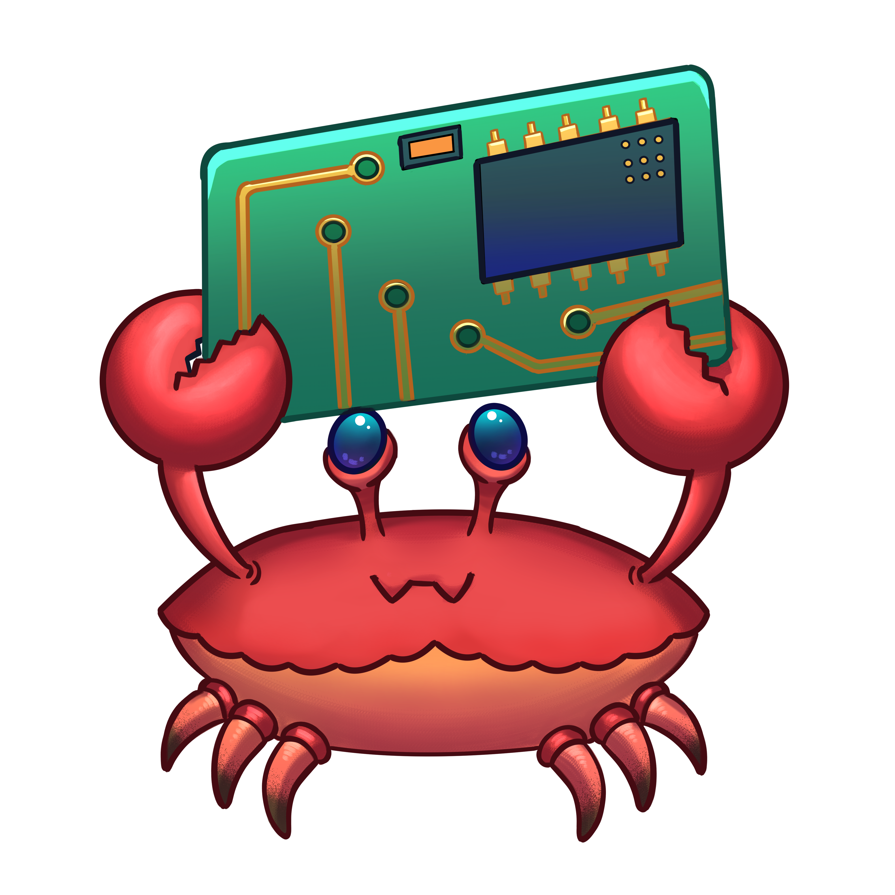

# golang-rust-message-bus

RustMQ! The message bus made in Rust and using Golang for testing the RustMQ.



#### Use Examples:

run the example server

```bash
// run the rustmq server 
cargo run --example server
```

run the example client

```bash
// run the rustmq client
cargo run --example client
```
